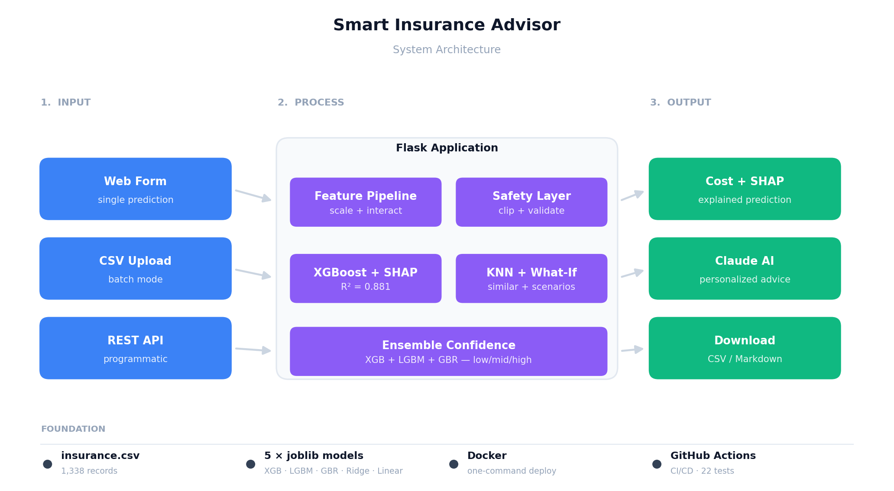
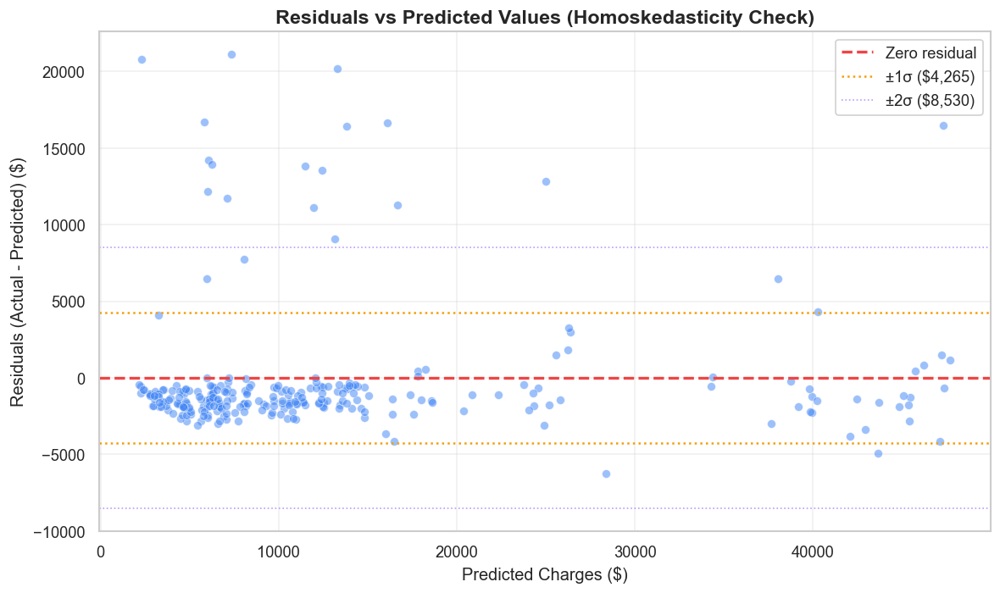

# Smart Insurance Advisor V2.0

[](https://www.python.org/)
[](https://flask.palletsprojects.com/)
[](https://xgboost.readthedocs.io/)
[](https://shap.readthedocs.io/)
[](#testing)
[](https://www.docker.com/)
[](#)

An end-to-end data mining pipeline that predicts annual insurance claim costs using ensemble machine learning, explains predictions with SHAP (Explainable AI), finds similar historical patients via KNN, supports batch CSV predictions, and delivers personalized health advice through Claude AI — all wrapped in a custom Flask web application.

---

## System Architecture



**Four-layer design:** User Interface → Flask Application → Machine Learning → Data & Storage. DevOps automation (Docker, CI/CD, pytest) supports the entire stack.

---

## Key Features

### Machine Learning
- **5 models trained & compared:** XGBoost (best), LightGBM, GradientBoosting, Ridge, Linear Regression
- **Hyperparameter optimization:** RandomizedSearchCV with 40 iterations × 5-fold CV = 600 model fits
- **Hybrid preprocessing:** Log-transform for linear models, raw target for boosting models
- **Feature engineering:** smoker×BMI and smoker×age interaction features
- **Best model:** XGBoost with R²=0.8812, RMSE=$4,295, MAE=$2,498

### Explainable AI
- **SHAP TreeExplainer** integrated for per-prediction feature attribution
- **Animated SHAP bar charts** rendered in pure CSS (no matplotlib dependency at runtime)
- **Global feature importance** analysis (smoking = 82.6% importance)

### Web Application
- **Real-time predictions** with animated cost counter
- **Multi-model confidence interval** (Low/Mid/High from 3 boosting models)
- **What-If Scenarios** — counterfactual analysis ("If you quit smoking: save $X")
- **Similar Patients (KNN)** — 5 most similar training records with actual costs
- **Batch CSV Prediction** — upload a CSV, get predictions + top SHAP feature per row
- **Claude AI Reports** — LLM-generated personalized health advice using SHAP context

### DevOps
- **Docker** — one-command deployment with `docker-compose up`
- **GitHub Actions CI/CD** — automated testing on every push (matrix: Python 3.11, 3.12)
- **22 pytest unit/integration tests** covering preprocessing, models, and endpoints
- **Cloud-ready** — deployment guides for Render, Railway (see [DEPLOYMENT.md](DEPLOYMENT.md))

---

## Model Performance

| Rank | Model              | R²       | RMSE ($) | MAE ($) |
|------|--------------------|----------|----------|---------|
| 1    | **XGBoost**        | **0.8812** | **4,295** | **2,498** |
| 2    | GradientBoosting   | 0.8775   | 4,361    | 2,467   |
| 3    | LightGBM           | 0.8755   | 4,396    | 2,583   |
| 4    | Ridge Regression   | 0.8396   | 4,990    | 2,518   |
| 5    | Linear Regression  | 0.8377   | 5,020    | 2,526   |

### Feature Importance (XGBoost)


**Key insight:** Smoking alone accounts for 82.6% of prediction importance — 5× the sum of all other features combined.

### Residuals vs Predicted



Approximately homoskedastic residuals centered around zero, with most predictions within ±$5,000.

---

## Project Structure

```
DataMiningInsurance/
├── README.md                           # This file
├── DEPLOYMENT.md                       # Cloud deployment guide
├── Dockerfile                          # Production container
├── docker-compose.yml                  # One-command orchestration
├── requirements.txt                    # Python dependencies
├── pytest.ini                          # Test configuration
├── presentation.html                   # 49-slide project presentation
├── report.md                           # IEEE-format research report (markdown)
├── Insurance_Cost_Prediction_IEEE_Report.docx  # Word IEEE report
│
├── .github/workflows/
│   └── ci.yml                          # GitHub Actions CI/CD pipeline
│
├── tests/                              # pytest test suite (22 tests)
│   ├── test_preprocessing.py           # Outlier handling & encoding
│   ├── test_models.py                  # Model loading & sanity checks
│   └── test_app_endpoints.py           # Flask endpoint integration tests
│
└── DataSet/
    ├── insurance.csv                   # Raw dataset (1,338 rows)
    ├── eda.ipynb                       # Exploratory Data Analysis
    ├── preprocessing.py                # IQR outlier + encoding + scaling
    ├── models.py                       # 5-model training with RandomizedSearchCV
    ├── evaluation.py                   # Metrics + visualization
    ├── app.py                          # Flask web app (654 lines)
    │
    ├── processed/                      # Train/test splits (CSV)
    ├── saved_models/                   # 5 trained models + feature names (.joblib)
    └── results/                        # 13 evaluation & EDA charts (PNG)
```

---

## Quick Start

### Option A: Local Python

```bash
# Clone and enter
git clone https://github.com/Dutchy-O-o/DataMiningInsurance.git
cd DataMiningInsurance

# Install dependencies
python -m venv venv
venv\Scripts\activate   # or: source venv/bin/activate
pip install -r requirements.txt

# (Optional) Add Claude API key for AI reports
echo "ANTHROPIC_API_KEY=sk-ant-..." > DataSet/.env

# Run the web app
cd DataSet
python app.py
```

Open `http://localhost:5000` in your browser.

### Option B: Docker

```bash
docker-compose up -d
```

See [DEPLOYMENT.md](DEPLOYMENT.md) for cloud deployment (Render, Railway).

---

## Dataset

**Source:** [Kaggle — Medical Cost Personal Datasets](https://www.kaggle.com/datasets/mirichoi0218/insurance)

| Feature    | Type        | Range          | Description                  |
|------------|-------------|----------------|------------------------------|
| `age`      | Integer     | 18–64          | Policyholder age             |
| `sex`      | Binary      | male / female  | Biological sex               |
| `bmi`      | Float       | 15.96–53.13    | Body Mass Index              |
| `children` | Integer     | 0–5            | Number of dependents         |
| `smoker`   | Binary      | yes / no       | Smoking status               |
| `region`   | 4-class     | NE/NW/SE/SW    | US region                    |
| `charges`  | **Float**   | **$1,122–$63,770** | **Annual insurance cost (TARGET)** |

**Stats:** 1,338 records · 0 missing values · 0 duplicates · Target skewness 1.52.

---

## Key Findings

1. **Smoker dominates** — 82.6% feature importance, 3.8× cost multiplier ($32,050 vs $8,434)
2. **Three cost clusters** — smoker×BMI interaction creates non-linear bands visible in scatter plots
3. **Boosting >> Linear** — XGBoost R²=0.88 beats Linear R²=0.84 by capturing interactions
4. **Log transform is model-dependent** — helps linear (skewness 1.52→-0.12), harms boosting (expm1 amplifies errors)
5. **Model-specific preprocessing wins** — one-size-fits-all pipelines leave accuracy on the table
6. **SHAP makes predictions actionable** — "smoking adds $12K to your cost" is far more useful than just a number

See the full analysis in [`report.md`](report.md) or the IEEE-format Word report.

---

## Testing

```bash
pytest tests/ -v
```

The 22-test suite covers:
- **Preprocessing** — IQR outlier detection, clipping invariants, dataset integrity
- **Models** — loading, prediction shape, smoker monotonicity, reproducibility
- **Endpoints** — `/predict`, `/batch_predict`, `/similar`, `/api/stats`, error handling

```
tests/test_preprocessing.py ..........  7 passed
tests/test_models.py .................  7 passed
tests/test_app_endpoints.py ..........  8 passed
=========================== 22 passed in 27s ===========================
```

---

## Technologies

| Category              | Technologies                                             |
|-----------------------|----------------------------------------------------------|
| **Language**          | Python 3.11+                                             |
| **Data Analysis**     | pandas, numpy, matplotlib, seaborn                       |
| **Machine Learning**  | scikit-learn, XGBoost, LightGBM                          |
| **Explainable AI**    | SHAP (TreeExplainer)                                     |
| **Generative AI**     | Anthropic Claude Haiku API                               |
| **Web Application**   | Flask, HTML5, CSS3, Vanilla JavaScript                   |
| **Testing**           | pytest, pytest-cov                                       |
| **DevOps**            | Docker, docker-compose, GitHub Actions                   |
| **Serialization**     | joblib                                                   |

---

## Documentation

- **[report.md](report.md)** — Full IEEE-format technical paper (markdown source)
- **[Insurance_Cost_Prediction_IEEE_Report.docx](Insurance_Cost_Prediction_IEEE_Report.docx)** — Word version (two-column IEEE layout)
- **[presentation.html](presentation.html)** — 49-slide project presentation (open in browser)
- **[DEPLOYMENT.md](DEPLOYMENT.md)** — Deployment guide (local, Docker, Render, Railway)

---

## Contributing

Pull requests are welcome. For major changes, please open an issue first to discuss.

### Development Workflow

```bash
# Install dev dependencies
pip install -r requirements.txt

# Run tests before committing
pytest tests/ -v

# Run the app locally
cd DataSet && python app.py
```

---

## License

MIT License — feel free to use this project for learning, research, or production (with attribution).

---

## Acknowledgments

- **Dataset:** Miri Choi via Kaggle
- **XGBoost:** Chen & Guestrin (2016)
- **SHAP:** Lundberg & Lee (2017)
- **Claude AI:** Anthropic
