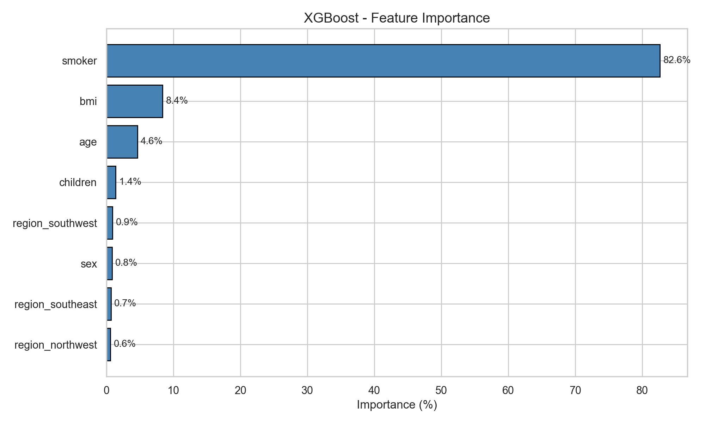

# Smart Insurance Advisor V2.0

[](https://www.python.org/)
[](https://flask.palletsprojects.com/)
[](https://xgboost.readthedocs.io/)
[](https://shap.readthedocs.io/)
[](#testing)
[](https://www.docker.com/)
[](#license)

An end-to-end data mining pipeline that predicts annual insurance claim costs, explains every prediction with SHAP, finds similar historical patients via KNN, supports batch CSV predictions, and delivers personalized health advice through Claude AI — all in a custom Flask web application.

---

## Quick Start

### Option A — Local Python (recommended for development)

```bash
# 1. Clone and enter
git clone https://github.com/Dutchy-O-o/DataMiningInsurance.git
cd DataMiningInsurance

# 2. Create virtual environment
python -m venv venv

# Windows
venv\Scripts\activate
# macOS / Linux
source venv/bin/activate

# 3. Install dependencies
pip install -r requirements.txt

# 4. (Optional) Enable Claude AI reports
echo "ANTHROPIC_API_KEY=sk-ant-your-key-here" > .env

# 5. Run it
python run.py
```

The browser opens automatically at **http://localhost:5000**.

### Option B — Docker (one command, production-grade)

```bash
# Build and run in one step
docker-compose up -d

# Or manually
docker build -t smart-insurance-advisor .
docker run -p 5000:5000 smart-insurance-advisor
```

Open **http://localhost:5000**.

### Option C — Run tests

```bash
pytest tests/ -v
```

You should see **23 passed** in about 25-30 seconds.

---

## Project Structure

```
DataMiningInsurance/
│
├── run.py                     # Entry point: python run.py
├── requirements.txt           # Pinned dependencies
├── Dockerfile                 # Production container
├── docker-compose.yml         # One-command orchestration
├── pytest.ini                 # Test configuration
├── .env.example               # Template for Anthropic API key
│
├── data/                      # Raw + processed data + plots
│   ├── insurance.csv          # Original dataset (1,338 records)
│   ├── processed/             # 80/20 train-test split CSVs
│   └── results/               # 14 EDA & evaluation plots (PNG)
│
├── models/                    # Trained model artefacts (.joblib)
│   ├── xgboost.joblib         # Primary model (R² = 0.88)
│   ├── lightgbm.joblib
│   ├── gradient_boosting.joblib
│   ├── ridge_regression.joblib
│   ├── linear_regression.joblib
│   └── feature_names.joblib
│
├── notebooks/
│   └── eda.ipynb              # Exploratory data analysis
│
├── src/                       # ML pipeline (run once to retrain)
│   ├── config.py              # All file paths in one place
│   ├── preprocessing.py       # IQR clipping, encoding, scaling, split
│   ├── training.py            # 5-model training + RandomizedSearchCV
│   └── evaluation.py          # Metrics + plots
│
├── webapp/                    # Flask app, split by responsibility
│   ├── __init__.py            # create_app() factory
│   ├── routes.py              # REST endpoints
│   ├── features.py            # Scaling + interaction features
│   ├── ml_service.py          # predict, SHAP, what-if scenarios
│   ├── similarity.py          # Smoker-stratified weighted KNN
│   ├── ai_service.py          # Claude API wrapper
│   ├── dashboard.py           # Precomputed stats + model leaderboard
│   ├── templates/
│   │   └── index.html         # Main UI
│   └── static/
│       ├── style.css          # Dark/light theme
│       └── app.js             # Frontend logic
│
├── tests/                     # 23 pytest tests
│   ├── test_preprocessing.py  # IQR + encoding sanity checks
│   ├── test_models.py         # Model loading + monotonicity
│   └── test_app_endpoints.py  # Flask integration tests
│
├── .github/workflows/
│   └── ci.yml                 # GitHub Actions CI/CD
│
├── README.md
├── DEPLOYMENT.md              # Cloud deployment guide (Render, Railway)
├── report.md                  # IEEE-format technical paper
├── presentation.html          # 57-slide project presentation
└── Insurance_Cost_Prediction_IEEE_Report.docx
```

---

## How It Works

### The ML Pipeline (one-time training)

If you want to retrain models from scratch:

```bash
# 1. Preprocess the raw CSV (clips outliers, encodes, scales, saves splits)
python -m src.preprocessing

# 2. Train all 5 models with hyperparameter search (~5-10 minutes)
python -m src.training

# 3. Generate evaluation plots (feature importance, residuals, actual vs predicted)
python -m src.evaluation
```

> Models are already trained and committed — you only need this if you changed `src/` code.

### The Web App (runtime)

When you run `python run.py`, the web app:

1. Loads XGBoost + 4 ensemble models from `models/`
2. Initializes SHAP TreeExplainer
3. Fits two KNN models (smoker / non-smoker) for similar-patient lookup
4. Precomputes dataset stats + 5-model leaderboard for the welcome screen
5. Starts Flask on port 5000 and opens your browser

### What the user sees

| Feature | What it does |
|---------|--------------|
| **Cost Prediction** | Animated counter showing predicted annual insurance charge |
| **Confidence Interval** | Low / Mid / High from 3 boosting models |
| **SHAP Breakdown** | Dollar-level contribution of each feature, as animated bars |
| **What-If Scenarios** | "If you quit smoking you'd save $X" (uses counterfactual predictions) |
| **Similar Patients** | 5 real training records with same smoker status, ranked by weighted distance |
| **Batch CSV Prediction** | Drag-drop a CSV; get predictions + top SHAP feature per row |
| **AI Report** | Claude Haiku writes a personalized health optimization report using SHAP context |
| **Dark / Light Mode** | Toggle button top-right, persisted in `localStorage` |

---

## Dataset

**Source:** [Kaggle — Medical Cost Personal Datasets](https://www.kaggle.com/datasets/mirichoi0218/insurance)

| Feature    | Type        | Range          | Description                  |
|------------|-------------|----------------|------------------------------|
| `age`      | Integer     | 18–64          | Policyholder age             |
| `sex`      | Binary      | male / female  | Biological sex               |
| `bmi`      | Float       | 15.96–53.13    | Body Mass Index              |
| `children` | Integer     | 0–5            | Number of dependents         |
| `smoker`   | Binary      | yes / no       | Smoking status               |
| `region`   | 4-class     | NE/NW/SE/SW    | US region                    |
| `charges`  | **Float**   | **$1,122–$63,770** | **Annual insurance cost (TARGET)** |

1,338 records · 0 missing values · 0 duplicates · target skewness 1.52.

---

## Model Performance

| Rank | Model              | R²       | RMSE ($) | MAE ($) |
|------|--------------------|----------|----------|---------|
| 1    | **XGBoost**        | **0.8812** | **4,295** | **2,498** |
| 2    | Gradient Boosting  | 0.8775   | 4,361    | 2,467   |
| 3    | LightGBM           | 0.8755   | 4,396    | 2,583   |
| 4    | Ridge Regression   | 0.8396   | 4,990    | 2,518   |
| 5    | Linear Regression  | 0.8377   | 5,020    | 2,526   |



---

## Architecture


Three-stage horizontal flow: **Input** → **Flask Processing** → **Output**. The Flask core contains the feature pipeline, safety layer, XGBoost+SHAP, KNN similarity, and ensemble confidence. Supporting foundation: CSV data, 5 joblib models, Docker, GitHub Actions CI, pytest.

---

## Key Findings

1. **Smoker dominates** — 82.6% feature importance, 3.8× cost multiplier ($32,050 vs $8,434)
2. **Three cost clusters** — the smoker×BMI interaction creates non-linear cost bands visible in scatter plots
3. **Boosting >> Linear** — XGBoost R²=0.88 beats Linear R²=0.84 by capturing interactions
4. **Log transform is model-dependent** — helps linear (skewness 1.52→-0.12), harms boosting (expm1 amplifies errors)
5. **Model-specific preprocessing wins** — one-size-fits-all pipelines leave accuracy on the table
6. **SHAP makes predictions actionable** — "smoking adds $12K to your cost" beats an opaque number

Full analysis in [`report.md`](report.md) or the [IEEE Word report](Insurance_Cost_Prediction_IEEE_Report.docx).

---

## Testing

```bash
pytest tests/ -v
```

The 23-test suite covers:

| Module | Tests | What it checks |
|--------|-------|----------------|
| `test_preprocessing.py` | 7 | IQR outlier detection, clipping invariants, dataset integrity |
| `test_models.py` | 7 | Model loading, smoker-monotonicity, reproducibility |
| `test_app_endpoints.py` | 9 | `/predict`, `/batch_predict`, `/similar`, `/api/stats`, error paths, smoker stratification |

Expected output:

```
tests/test_preprocessing.py ..........  7 passed
tests/test_models.py .................  7 passed
tests/test_app_endpoints.py ..........  9 passed
=========================== 23 passed in 27s ===========================
```

---

## REST API

Once running, the app exposes these endpoints:

| Method | Path | Description |
|--------|------|-------------|
| GET  | `/`              | Web UI |
| GET  | `/api/stats`     | Dataset statistics + model leaderboard |
| POST | `/predict`       | Full prediction (cost + SHAP + confidence + similar + AI advice) |
| POST | `/similar`       | 5 nearest patients (smoker-stratified KNN) |
| POST | `/batch_predict` | CSV upload, returns per-row predictions + top SHAP feature |
| POST | `/download-report` | Exports the AI report as markdown |

Example request:

```bash
curl -X POST http://localhost:5000/predict \
  -H "Content-Type: application/json" \
  -d '{"age":35,"sex":"male","bmi":27.5,"children":1,"smoker":"no","region":"southeast"}'
```

---

## Technologies

| Layer | Stack |
|-------|-------|
| **Language** | Python 3.11+ |
| **Data** | pandas, numpy |
| **ML** | scikit-learn, XGBoost, LightGBM, joblib |
| **XAI** | SHAP (TreeExplainer) |
| **AI** | Anthropic Claude Haiku |
| **Web** | Flask, vanilla HTML/CSS/JS (no framework) |
| **Testing** | pytest, pytest-cov |
| **DevOps** | Docker, docker-compose, GitHub Actions |
| **Visualization** | matplotlib, seaborn (for plots generated offline) |

---

## Documentation

- **[report.md](report.md)** — Full IEEE-format technical paper (markdown)
- **[Insurance_Cost_Prediction_IEEE_Report.docx](Insurance_Cost_Prediction_IEEE_Report.docx)** — Two-column IEEE Word version
- **[presentation.html](presentation.html)** — 57-slide project walkthrough (open in browser)
- **[DEPLOYMENT.md](DEPLOYMENT.md)** — Cloud deployment guide (Render, Railway)

---

## Troubleshooting

### "ModuleNotFoundError: No module named 'webapp'"
Run from the repo root (`python run.py`), not from inside `webapp/`.

### "InconsistentVersionWarning" when loading models
Your pip installed different versions than what trained the models. Reinstall with:
```bash
pip install -r requirements.txt
```

### Docker container starts but only 2 models load
Same cause as above — versions in `requirements.txt` must match the training environment. The pinned versions in this repo are correct; rebuild with `docker-compose build --no-cache`.

### Port 5000 already in use
```bash
# Pick another port
PORT=5001 python run.py
```

---

## License

MIT License — free to use for learning, research, or production (with attribution).

---

## Acknowledgments

- **Dataset:** Miri Choi via Kaggle
- **XGBoost:** Chen & Guestrin (2016)
- **SHAP:** Lundberg & Lee (2017)
- **Claude AI:** Anthropic
