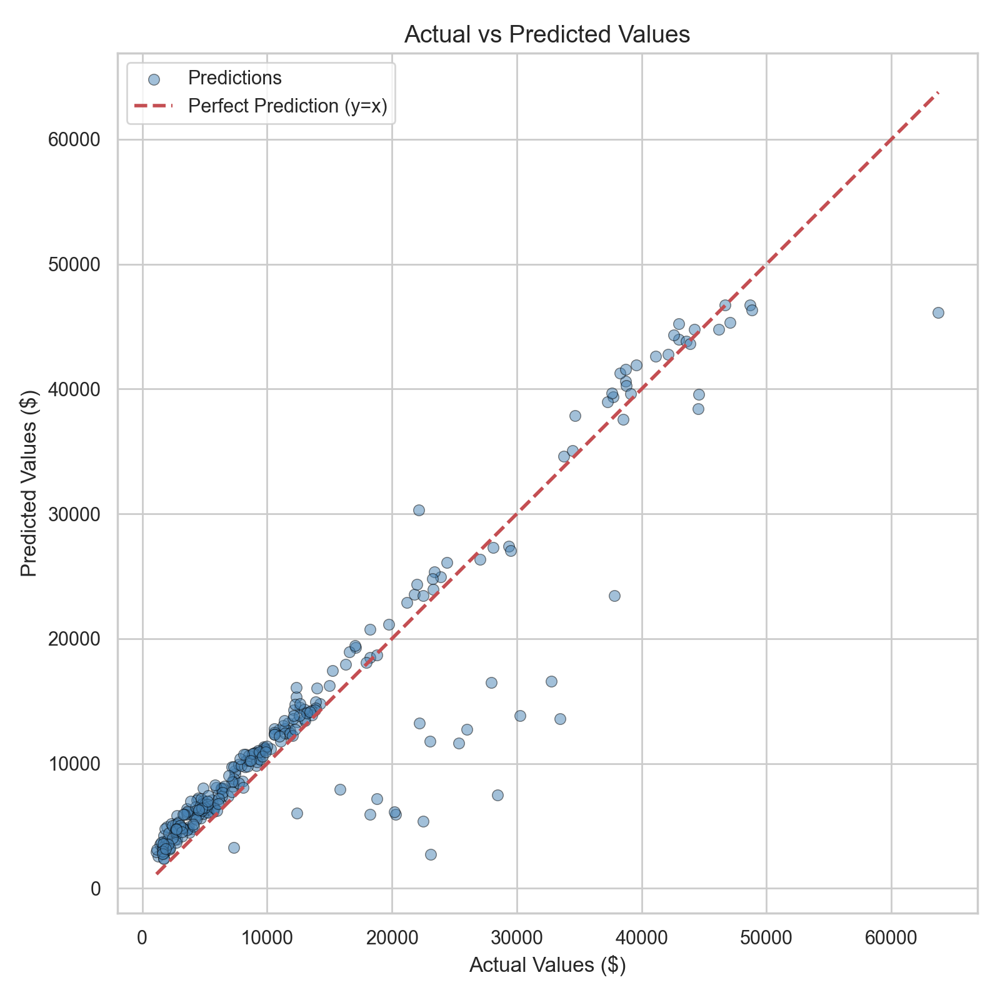
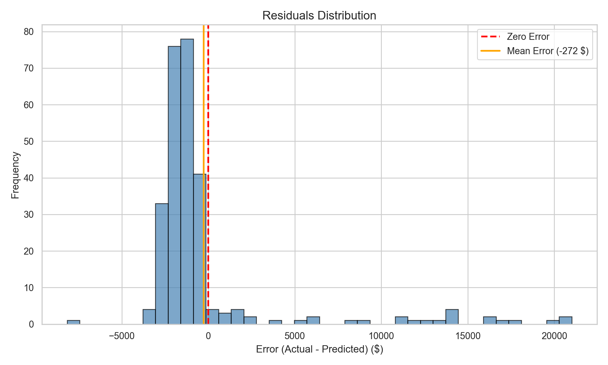

# Insurance Claim Cost Prediction - Data Mining Project

An end-to-end data mining project that predicts insurance claim costs using machine learning (XGBoost, LightGBM, GradientBoosting), explains predictions with SHAP (Explainable AI), and delivers personalized health advice through Claude AI - all wrapped in a custom-designed web dashboard.

## Project Overview

This project analyzes the `insurance.csv` dataset (1,338 records) to predict annual insurance charges based on demographic and health features. Five regression models were trained and compared. The best model (**XGBoost**) is deployed as an interactive web application with SHAP explainability and Claude AI integration.

## Project Structure

```
DataMiningInsurance/
├── README.md
├── requirements.txt
│
└── DataSet/
    ├── insurance.csv                # Raw dataset (1,338 rows, 7 columns)
    ├── eda.ipynb                    # Exploratory Data Analysis notebook
    ├── preprocessing.py             # Data preprocessing pipeline
    ├── models.py                    # Model training V2 (feature engineering + tuning)
    ├── evaluation.py                # Model evaluation & visualization
    ├── app.py                       # Flask web app (Smart Insurance Advisor V2.0)
    │
    ├── processed/                   # Preprocessed train/test splits
    │   ├── X_train.csv
    │   ├── X_test.csv
    │   ├── y_train.csv
    │   ├── y_test.csv
    │   └── insurance_preprocessed.csv
    │
    ├── saved_models/                # Trained model files (.joblib)
    │   ├── xgboost.joblib
    │   ├── lightgbm.joblib
    │   ├── gradient_boosting.joblib
    │   ├── linear_regression.joblib
    │   ├── ridge_regression.joblib
    │   └── feature_names.joblib
    │
    ├── results/                     # Evaluation charts (PNG)
    │   ├── feature_importance.png
    │   ├── actual_vs_predicted.png
    │   └── residuals_distribution.png
    │
    └── .streamlit/
        └── secrets.toml             # API key configuration
```

## Dataset

**Source:** [Kaggle - Medical Cost Personal Datasets](https://www.kaggle.com/datasets/mirichoi0218/insurance)

| Feature    | Type        | Description                              |
|------------|-------------|------------------------------------------|
| `age`      | Integer     | Age of the policyholder (18-64)          |
| `sex`      | Categorical | Gender (male / female)                   |
| `bmi`      | Float       | Body Mass Index                          |
| `children` | Integer     | Number of dependents (0-5)               |
| `smoker`   | Categorical | Smoking status (yes / no)                |
| `region`   | Categorical | US residential region (4 regions)        |
| `charges`  | Float       | **Target** - Annual insurance cost ($)   |

**Dataset Statistics:**
- 1,338 records, 7 features, 0 missing values
- Average annual cost: $13,270
- Smokers (20.5%) pay on average **$32,050** vs non-smokers **$8,434** (3.8x difference)
- Target variable is right-skewed (skewness = 1.52)

---

## Pipeline

### 1. Exploratory Data Analysis (`eda.ipynb`)

Comprehensive analysis of the dataset through 8 sections:

**Missing Values Analysis:**
- Zero missing values across all 7 columns
- Verified with both numerical check and heatmap visualization

**Statistical Summary:**

| Statistic | Age   | BMI    | Children | Charges    |
|-----------|-------|--------|----------|------------|
| Mean      | 39.2  | 30.7   | 1.1      | $13,270    |
| Std       | 14.0  | 6.1    | 1.2      | $12,110    |
| Min       | 18    | 16.0   | 0        | $1,122     |
| Max       | 64    | 53.1   | 5        | $63,770    |

**Target Variable (charges) Distribution:**



- Right-skewed distribution (skewness = 1.52, kurtosis = 1.61)
- Majority of policyholders pay under $15,000/year
- A separate high-cost cluster exists (primarily smokers)

**Correlation Analysis:**

| Feature          | Correlation with Charges |
|------------------|------------------------:|
| smoker           |                  0.7873 |
| age              |                  0.2990 |
| bmi              |                  0.1983 |
| children         |                  0.0680 |
| sex              |                  0.0573 |
| region_southeast |                  0.0740 |

**Key EDA Visualizations (from `eda.ipynb`):**
- **Age vs Charges scatter plot** (colored by smoker status) - reveals 3 distinct cost tiers
- **BMI vs Charges scatter plot** - shows non-linear interaction between BMI and smoking
- **Categorical box plots** (sex, smoker, region, children vs charges)
- **Pair plot** - multivariate relationships colored by smoker status
- **Correlation heatmap** - encoded features correlation matrix

**EDA Conclusions:**
1. `smoker` is the dominant predictor (r = 0.79)
2. Three distinct cost clusters visible: non-smokers (low), smokers with normal BMI (medium), smokers with high BMI (high)
3. `age` shows a clear positive linear trend with cost
4. `region` and `sex` have negligible impact
5. The non-linear smoker x BMI interaction suggests boosting models will outperform linear models

---

### 2. Preprocessing (`preprocessing.py`)

| Step | Method | Details |
|------|--------|---------|
| Outlier Clipping | IQR Method | Applied to `age`, `bmi`, `children` only (target preserved) |
| Label Encoding | Binary | `sex` (male=1, female=0), `smoker` (yes=1, no=0) |
| One-Hot Encoding | drop_first | `region` -> 3 dummy columns (baseline=northeast) |
| Scaling | StandardScaler | `age` (mean=39.21, std=14.04), `bmi` (mean=30.65, std=6.05), `children` (mean=1.09, std=1.21) |
| Train/Test Split | 80/20 | 1,070 train / 268 test rows (random_state=42) |

**Important design decision:** Outlier clipping was NOT applied to the target variable (`charges`) since this is a regression problem and extreme values represent real high-cost cases that the model must learn.

---

### 3. Model Training V2 (`models.py`)

**V2 Enhancements over V1:**
- **Feature Engineering:** Added `smoker_bmi` and `smoker_age` interaction features (capturing the non-linear clusters found in EDA)
- **Hybrid target strategy:** Log transform (`np.log1p`) for Linear/Ridge models only; raw target for boosting models (trees handle skewness natively)
- **Expanded search:** 40 RandomizedSearchCV iterations with regularization parameters

**Model Comparison (V2.0):**

| Rank | Model              | R2     | RMSE    | MAE     | Tuning                      |
|------|--------------------|--------|---------|---------|------------------------------|
| 1    | **XGBoost**        | 0.8812 | 4,295   | 2,498   | RandomizedSearchCV (40 iter) |
| 2    | GradientBoosting   | 0.8775 | 4,361   | 2,467   | RandomizedSearchCV (40 iter) |
| 3    | LightGBM           | 0.8755 | 4,396   | 2,583   | RandomizedSearchCV (40 iter) |
| 4    | Ridge Regression   | 0.8396 | 4,990   | 2,518   | log1p target                 |
| 5    | Linear Regression  | 0.8377 | 5,020   | 2,526   | log1p target                 |

**Key observations:**
- Boosting models significantly outperform linear models (~5% R2 improvement)
- Interaction features boosted Linear/Ridge from R2=0.78 (V1) to R2=0.84 (V2)
- XGBoost best params: `n_estimators=500, max_depth=3, learning_rate=0.01, subsample=0.8`
- Log transform helped linear models but hurt boosting models (expm1 amplifies errors at high values)

---

### 4. Evaluation (`evaluation.py`)

Generates three evaluation charts for the best model (XGBoost):

**Feature Importance:**


| Feature  | Importance |
|----------|----------:|
| smoker   |    82.6%  |
| bmi      |     8.4%  |
| age      |     4.6%  |
| children |     1.4%  |
| region   |     2.2%  |
| sex      |     0.8%  |

**Actual vs Predicted:**


- Points closely follow the y=x line, indicating good prediction accuracy
- Slight deviation at very high cost values (>$50,000)

**Residuals Distribution:**



- Errors centered near zero (mean error = -$272)
- Most predictions within +/- $5,000
- Right tail shows some under-prediction for extreme high-cost cases

---

### 5. Web Application V2.0 (`app.py`)

Interactive **Smart Insurance Advisor** built with Flask + custom HTML/CSS/JS:

**Welcome Dashboard:**
- Dataset overview with 6 animated stat cards (total records, avg cost, smoker %, etc.)
- Model performance comparison chart (5 models, animated bar chart with R2 scores)
- Key finding highlight box

**Prediction Engine:**
- User inputs: Age (slider), Sex, Height/Weight (auto BMI calculation with color-coded category), Children, Smoker, Region
- Real-time XGBoost prediction with animated cost counter
- **Confidence interval** using ensemble of 3 boosting models (Low / Avg / High)
- **What-If scenarios:** "If you quit smoking" and "If BMI reaches 25" with savings calculation
- Negative savings are automatically filtered (prevents misleading advice)

**SHAP Explainability (XAI):**
- Per-prediction SHAP analysis rendered as animated HTML/CSS bar chart
- Purple bars = increases cost, Cyan bars = decreases cost
- Bars animate on load with staggered cubic-bezier easing

**Claude AI Integration:**
- SHAP top-2 features dynamically injected into Claude Haiku prompt
- AI generates personalized "Insurance & Health Optimization Report"
- Report references specific dollar amounts and SHAP findings
- Download report as `.md` file

**Design:**
- Custom dark theme (glassmorphism, gradient backgrounds, Inter font)
- Fully responsive (mobile-friendly)
- Zero Streamlit / zero framework - pure HTML/CSS/JS
- Auto-opens browser on `python app.py`

---

## Setup & Installation

```bash
# Navigate to the project directory
cd DataMiningInsurance

# Create and activate virtual environment
python -m venv venv
venv\Scripts\activate          # Windows
# source venv/bin/activate     # macOS/Linux

# Install all dependencies
pip install -r requirements.txt
```

## Usage

### Run the full pipeline

```bash
cd DataSet

# Step 1: Preprocessing
python preprocessing.py

# Step 2: Train all models (V2 with feature engineering)
python models.py

# Step 3: Evaluate best model + generate charts
python evaluation.py
```

### Run the web application

```bash
cd DataSet

# (Optional) Add your Claude AI API key for personalized reports
# Edit .streamlit/secrets.toml:
# ANTHROPIC_API_KEY = "sk-ant-..."

# Start the application (auto-opens browser)
python app.py
```

> The web app works fully without an API key. Claude AI advice is an optional enhancement.

### Run the EDA notebook

```bash
cd DataSet
python -m notebook
# Open eda.ipynb in the browser and run all cells
```

---

## Key Findings

1. **Smoking is the #1 cost driver** - 82.6% feature importance, smokers pay 3.8x more ($32,050 vs $8,434 average)
2. **Non-linear interactions matter** - The smoker x BMI interaction creates distinct cost clusters that only tree-based models can capture effectively
3. **Boosting >> Linear** - XGBoost (R2=0.88) outperforms Linear Regression (R2=0.84) by capturing these non-linear patterns
4. **Log transform is model-dependent** - Helps linear models (skewness correction) but hurts boosting models (expm1 error amplification)
5. **BMI and age are secondary factors** - BMI contributes 8.4% and age 4.6% to predictions
6. **Region and sex are negligible** - Combined less than 3% importance

---

## Technologies

| Category | Technologies |
|----------|-------------|
| **Language** | Python 3.13 |
| **Data Analysis** | pandas, numpy, matplotlib, seaborn |
| **Machine Learning** | scikit-learn, XGBoost, LightGBM |
| **Explainable AI** | SHAP (TreeExplainer) |
| **Generative AI** | Anthropic Claude Haiku API |
| **Web Application** | Flask, HTML5, CSS3, JavaScript |
| **Serialization** | joblib |
| **Notebook** | Jupyter |
