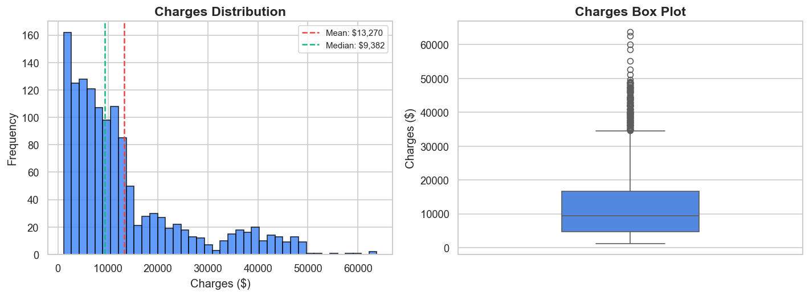
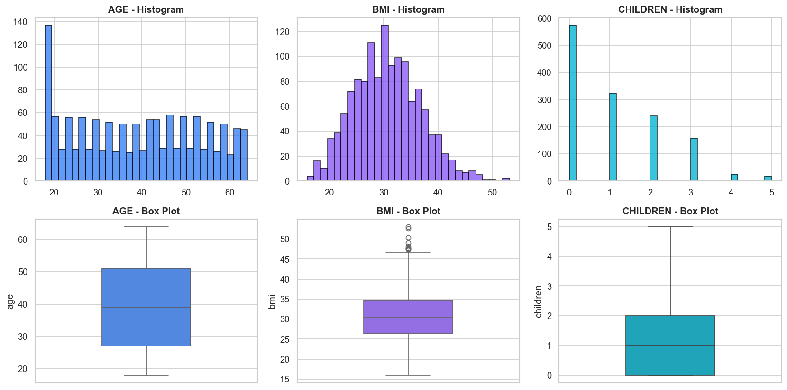
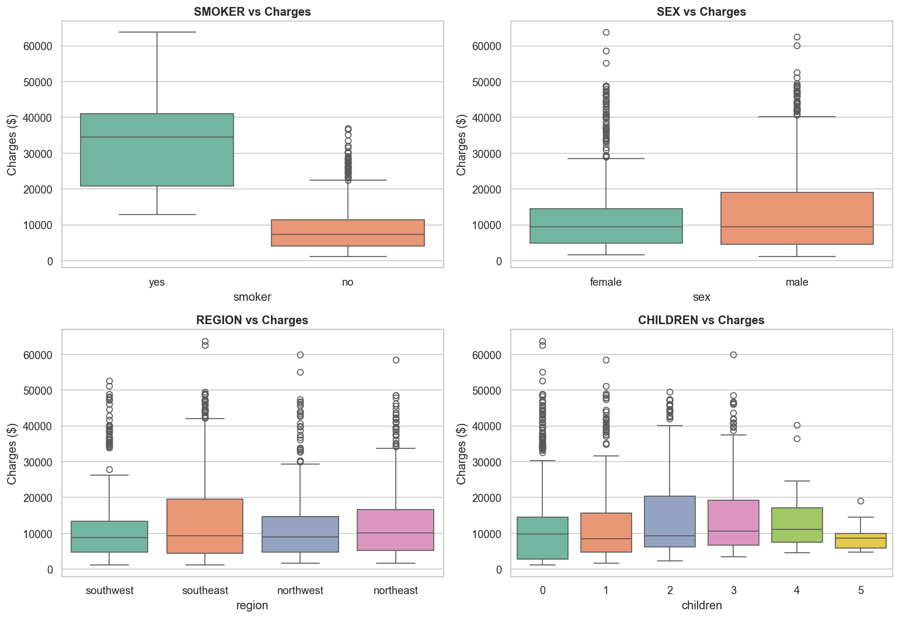
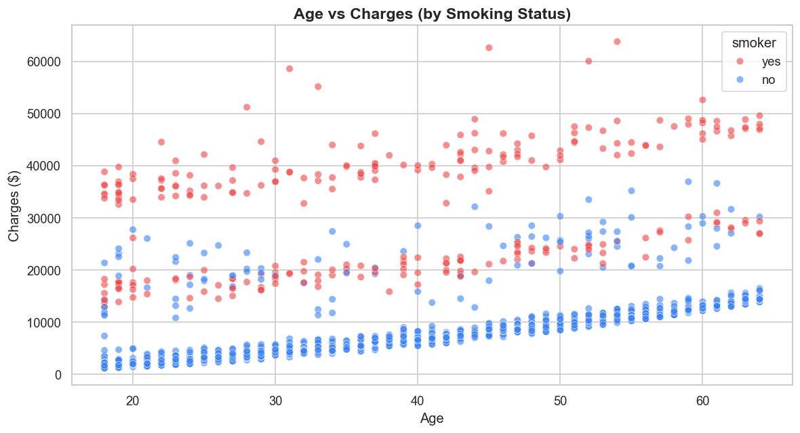
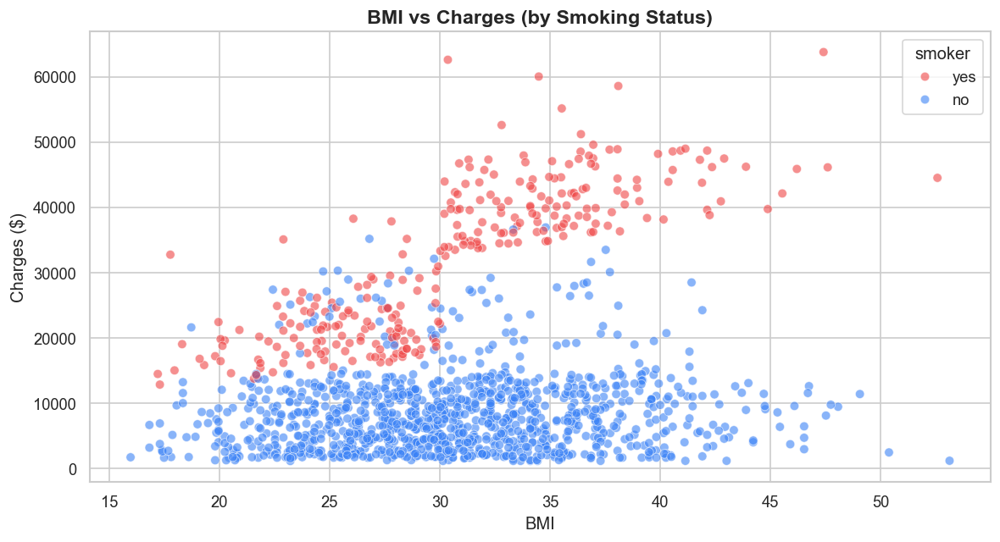
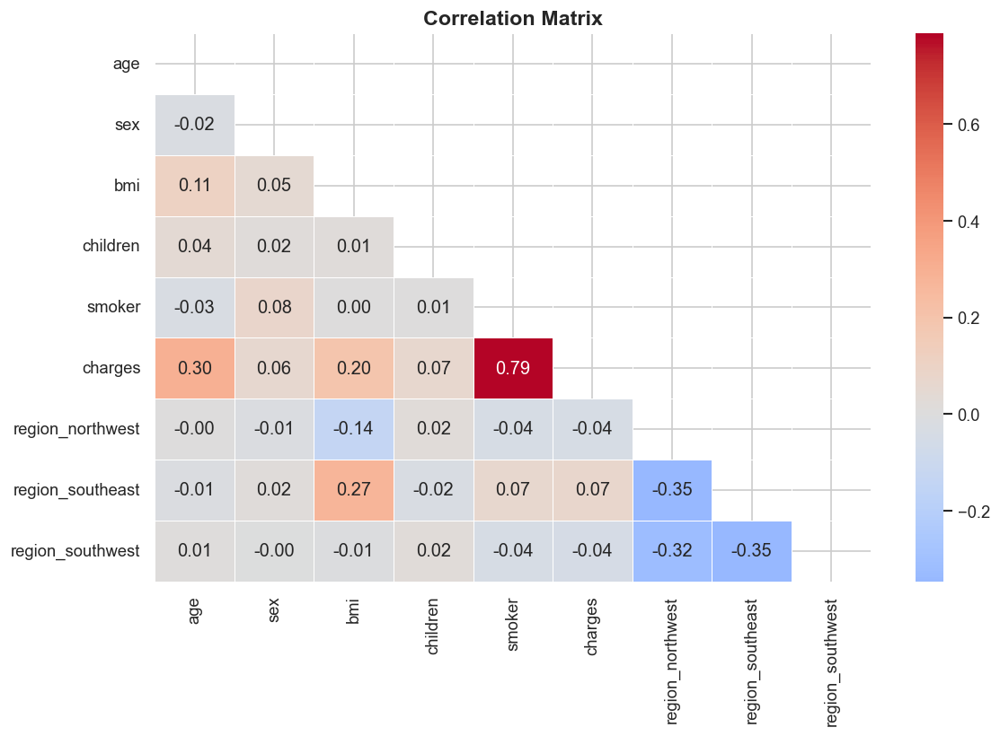
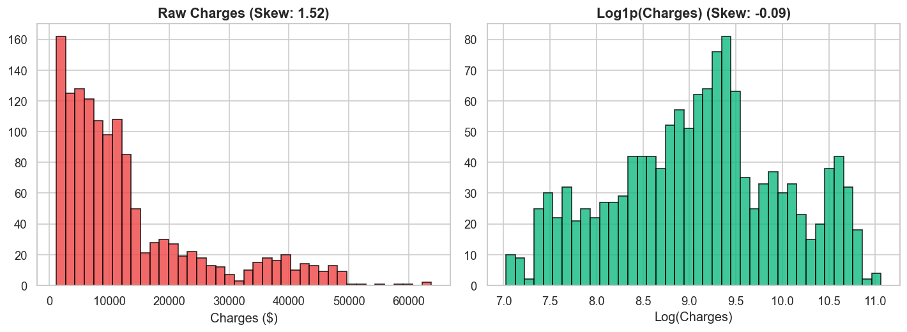

# Insurance Claim Cost Prediction Using Ensemble Machine Learning, Explainable AI, and Generative AI: A Comprehensive Data Mining Approach

---

**Abstract** — This paper presents a comprehensive end-to-end data mining pipeline for predicting annual insurance claim costs using ensemble machine learning methods enhanced with explainable AI and generative AI capabilities. The study analyzes the Medical Cost Personal Dataset comprising 1,338 policyholder records with six demographic and health-related features. Through rigorous exploratory data analysis (EDA), we discover three distinct cost clusters driven by the non-linear interaction between smoking status and BMI, along with significant target variable skewness (1.52). A novel model-family-specific preprocessing strategy is introduced, applying log-transformed targets for linear models while preserving raw targets for tree-based models. Five regression models are trained — Linear Regression, Ridge Regression, XGBoost, LightGBM, and Gradient Boosting Regressor — with extensive hyperparameter optimization via RandomizedSearchCV (40 iterations, 5-fold cross-validation per model). XGBoost achieves the best performance with R²=0.8812, RMSE=$4,295, and MAE=$2,498. SHAP (SHapley Additive exPlanations) analysis reveals smoking status accounts for 82.6% of feature importance. The system is deployed as a production-grade Flask web application featuring real-time multi-model predictions with confidence intervals, counterfactual what-if scenario analysis, animated SHAP-based cost breakdowns, and Claude AI-generated personalized health optimization reports. The complete system demonstrates how modern data mining extends beyond model training into interpretability, actionability, and user-facing deployment.

**Keywords** — Data Mining, Insurance Cost Prediction, XGBoost, LightGBM, Gradient Boosting, SHAP, Explainable AI, Feature Engineering, Interaction Features, Log Transform, Ensemble Learning, Flask Web Application, Generative AI, Claude API, CRISP-DM

---

## I. INTRODUCTION

Insurance cost prediction is a fundamental challenge at the intersection of actuarial science, healthcare analytics, and machine learning. The ability to accurately predict individual insurance charges has far-reaching implications: insurance companies can set fair, risk-adjusted premiums; policyholders gain awareness of the modifiable factors driving their costs; and healthcare systems can identify high-risk populations for targeted intervention programs [1].

Traditional actuarial approaches rely on generalized linear models (GLMs) and statistical rate tables that assume linear, additive relationships between risk factors and cost outcomes. While interpretable, these methods systematically fail to capture complex, non-linear interactions — such as the compounding effect of smoking combined with obesity — that significantly drive cost variation in real-world populations [2].

The emergence of gradient boosting ensemble methods, particularly XGBoost [3] and LightGBM [4], has revolutionized tabular prediction tasks. These algorithms learn non-linear patterns through sequential tree construction, where each tree corrects the errors of its predecessors. However, their "black-box" nature raises concerns in regulated domains like insurance, where decisions must be explainable and auditable.

SHAP (SHapley Additive exPlanations) [5] addresses this interpretability gap by decomposing each prediction into per-feature contributions grounded in cooperative game theory. When combined with generative AI — specifically large language models like Claude — these numerical explanations can be transformed into natural language advice that is accessible to non-technical users.

This paper presents a comprehensive data mining project following the CRISP-DM (Cross-Industry Standard Process for Data Mining) methodology [6] with the following specific contributions:

1. **Thorough Exploratory Data Analysis:** Statistical and visual analysis revealing three distinct cost clusters, the dominant role of smoking status (r=0.787), non-linear smoker×BMI interaction patterns, and target variable characteristics that inform all downstream decisions.

2. **Model-Family-Specific Preprocessing:** A novel hybrid strategy applying log1p target transformation for linear models while preserving raw targets for boosting models, based on empirical evidence that expm1 back-transformation amplifies prediction errors at high cost values.

3. **Engineered Interaction Features:** Two domain-informed interaction features (smoker×BMI, smoker×age) that capture the non-linear cost synergies discovered during EDA, improving linear model R² by 6 percentage points.

4. **Multi-Layer Regularization:** A 4-layer overfitting protection scheme for boosting models combining L1 regularization (reg_alpha), L2 regularization (reg_lambda), row subsampling, and column subsampling, optimized through extensive hyperparameter search.

5. **Comprehensive Model Comparison:** Systematic evaluation of five regression models with 600 total cross-validation fits (40 iterations × 5 folds × 3 boosting models), reporting R², RMSE, and MAE metrics.

6. **Integrated Explainability:** SHAP TreeExplainer providing both global feature importance analysis and per-prediction cost decomposition, feeding directly into generative AI for actionable advice.

7. **Production Deployment:** A Flask web application with custom-designed UI, multi-model confidence intervals, counterfactual scenario engine, animated SHAP visualizations, and Claude AI integration for personalized health reports.

The remainder of this paper is organized as follows: Section II reviews related work in insurance prediction and explainable AI. Section III describes the dataset in detail. Section IV covers the complete methodology including EDA, preprocessing, feature engineering, and model training. Section V presents results with extensive analysis. Section VI details the web application architecture. Section VII concludes with key findings and future work directions.

---

## II. RELATED WORK

### A. Insurance Cost Prediction

Insurance cost prediction using machine learning has been extensively studied in recent literature. Boodhun and Jayabalan [2] applied multiple regression models to medical insurance data, finding that smoking status and BMI were the most significant predictors, with R² values between 0.75 and 0.86 using tree-based methods. However, their study did not explore interaction features or model-specific preprocessing strategies.

Rawat et al. [7] compared Linear Regression, Decision Trees, and Random Forest on a similar insurance dataset, achieving R²=0.83 with Random Forest. Their work lacked hyperparameter optimization and feature engineering beyond basic encoding.

Kumar and Kaur [8] applied neural networks to insurance cost prediction, achieving R²=0.85. However, the neural network approach sacrificed interpretability and required significantly more training data and computational resources compared to gradient boosting methods for marginal performance gains.

### B. Ensemble Methods for Tabular Data

Chen and Guestrin [3] introduced XGBoost (Extreme Gradient Boosting), which combines gradient boosting with L1/L2 regularization, column subsampling, and hardware-optimized implementation. XGBoost has since become the dominant algorithm in structured data competitions on platforms like Kaggle.

Ke et al. [4] proposed LightGBM with histogram-based split finding and leaf-wise tree growth (vs. XGBoost's level-wise approach). LightGBM achieves comparable accuracy with significantly faster training times, particularly on larger datasets.

Friedman [9] introduced the original Gradient Boosting Machine (GBM), establishing the theoretical foundation for sequential ensemble learning. Scikit-learn's GradientBoostingRegressor [10] provides a well-tested implementation that serves as a reliable baseline.

### C. Explainable AI in Insurance

The need for model interpretability in high-stakes domains like insurance has driven the adoption of Explainable AI (XAI) techniques. The EU AI Act and similar regulations increasingly require that automated decisions affecting individuals be explainable and auditable [11].

Lundberg and Lee [5] introduced SHAP values based on Shapley values from cooperative game theory, providing a unified framework for feature attribution. SHAP satisfies three desirable theoretical properties: (1) *local accuracy* — SHAP values sum to the model's prediction; (2) *missingness* — features not present contribute zero; (3) *consistency* — if a feature's contribution increases in a revised model, its SHAP value does not decrease.

TreeSHAP [12] extends SHAP with an exact, polynomial-time algorithm for tree-based models, enabling real-time SHAP computation without the exponential cost of brute-force Shapley value calculation.

### D. Generative AI for Actionable Insights

The integration of large language models (LLMs) with structured prediction systems represents an emerging paradigm in applied machine learning. By feeding model outputs and explanations into LLMs, numerical results can be transformed into personalized, natural language advice that non-technical users can understand and act upon [13].

Our work extends prior studies by combining all these elements — feature engineering, multi-model ensemble comparison, SHAP explainability, and generative AI — in a deployable web application. This integrated approach bridges the gap between model development and end-user value delivery.

---

## III. DATASET DESCRIPTION

### A. Data Source

The dataset used in this study is the Medical Cost Personal Dataset, publicly available on the Kaggle platform [14]. It contains 1,338 records of insurance policyholders in the United States, collected for educational and research purposes. Each record includes six input features and one continuous target variable representing annual insurance charges.

### B. Feature Description

Table I provides a complete description of all features in the dataset.

| Feature | Type | Range | Description |
|---------|------|-------|-------------|
| age | Numerical (int) | 18–64 | Age of the policyholder in years |
| sex | Categorical (binary) | male, female | Biological sex of the policyholder |
| bmi | Numerical (float) | 15.96–53.13 | Body Mass Index (weight in kg / height in m²) |
| children | Numerical (int) | 0–5 | Number of dependents covered by the insurance |
| smoker | Categorical (binary) | yes, no | Whether the policyholder smokes |
| region | Categorical (4-class) | NE, NW, SE, SW | US geographic region of residence |
| **charges** | **Numerical (float)** | **$1,122–$63,770** | **Annual insurance cost (TARGET)** |

*Table I: Feature description for the Medical Cost Personal Dataset.*

### C. Statistical Summary

Table II presents the descriptive statistics for numerical features.

| Statistic | Age | BMI | Children | Charges |
|-----------|-----|-----|----------|---------|
| Count | 1,338 | 1,338 | 1,338 | 1,338 |
| Mean | 39.21 | 30.66 | 1.09 | $13,270 |
| Std Dev | 14.05 | 6.10 | 1.21 | $12,110 |
| Min | 18 | 15.96 | 0 | $1,122 |
| Q1 (25%) | 27 | 26.30 | 0 | $4,740 |
| Median (50%) | 39 | 30.40 | 1 | $9,382 |
| Q3 (75%) | 51 | 34.69 | 2 | $16,640 |
| Max | 64 | 53.13 | 5 | $63,770 |
| Skewness | 0.06 | 0.28 | 0.94 | **1.52** |
| Kurtosis | -1.25 | 0.05 | 0.17 | **1.61** |

*Table II: Descriptive statistics of numerical features.*

### D. Categorical Feature Distribution

Table III presents the distribution of categorical features.

| Feature | Category | Count | Percentage |
|---------|----------|-------|------------|
| sex | male | 676 | 50.5% |
| sex | female | 662 | 49.5% |
| smoker | no | 1,064 | 79.5% |
| smoker | yes | 274 | 20.5% |
| region | southeast | 364 | 27.2% |
| region | southwest | 325 | 24.3% |
| region | northwest | 325 | 24.3% |
| region | northeast | 324 | 24.2% |
| children | 0 | 574 | 42.9% |
| children | 1 | 324 | 24.2% |
| children | 2 | 240 | 17.9% |
| children | 3 | 157 | 11.7% |
| children | 4 | 25 | 1.9% |
| children | 5 | 18 | 1.3% |

*Table III: Distribution of categorical features.*

Key observations from the categorical distributions:
- **Sex** is nearly perfectly balanced (50.5% male vs. 49.5% female), minimizing gender bias risk.
- **Smoker** exhibits significant class imbalance (79.5% non-smoker vs. 20.5% smoker), making it crucial for models to accurately learn the minority smoker class.
- **Region** is approximately uniformly distributed across all four US regions.
- **Children** follows a right-skewed discrete distribution, with 42.9% of policyholders having zero dependents.

### E. Data Quality Assessment

The dataset was assessed for quality issues:
- **Missing values:** Zero missing values across all 7 features (confirmed via `df.isnull().sum()`)
- **Duplicates:** No duplicate records detected
- **Data types:** Correctly typed — integers for age and children, floats for bmi and charges, strings for categorical features

The absence of missing values and duplicates indicates a clean, pre-processed dataset that requires no imputation strategies.

---

## IV. METHODOLOGY

The complete methodology follows the CRISP-DM framework, progressing through Business Understanding (insurance cost prediction), Data Understanding (EDA), Data Preparation (preprocessing and feature engineering), Modeling (5 models with hyperparameter optimization), Evaluation (metrics and SHAP analysis), and Deployment (Flask web application).

### A. Exploratory Data Analysis

EDA was conducted in `eda.ipynb` using pandas, matplotlib, and seaborn libraries. The analysis proceeded through seven systematic stages.

#### 1) Target Variable Distribution Analysis

The target variable (charges) was analyzed through histogram and box plot visualizations (Fig. 1).

*Fig. 1: Distribution of the target variable (charges). Left: Histogram showing right-skewed distribution with mean ($13,270, red dashed) significantly exceeding median ($9,382, green dashed). Right: Box plot revealing numerous upper outliers extending to $63,770.*

Key findings from the target distribution analysis:
- **Severe right-skewness** (skewness = 1.52) indicating a long right tail of high-cost cases
- **Positive excess kurtosis** (1.61) indicating heavier tails than a normal distribution
- **Mean-median gap** of $3,888 ($13,270 vs. $9,382), confirming the skew
- **Multiple modes** visible in the histogram, suggesting underlying sub-populations
- **Numerous upper outliers** in the box plot, predominantly smoker records

The high skewness (1.52) has direct implications for model selection: linear models assuming normally distributed residuals will be biased, while tree-based models can handle the skewness through adaptive partitioning. This finding motivated the hybrid log-transform strategy described in Section IV-C.

#### 2) Numerical Feature Distribution Analysis

All numerical features were analyzed through paired histogram and box plot visualizations (Fig. 2).

*Fig. 2: Distribution of numerical features. Top row: Histograms. Bottom row: Box plots. Age is nearly symmetric (skew=0.06), BMI is slightly right-skewed with 9 outliers (skew=0.28), and Children is discretely right-skewed (skew=0.94).*

Detailed numerical distribution findings:

- **Age (skewness = 0.06):** Nearly perfectly symmetric uniform distribution between 18 and 64. No outliers detected. The uniform spread ensures the model sees adequate representation across all age groups.

- **BMI (skewness = 0.28):** Slightly right-skewed, approximately normally distributed around mean 30.66. Nine outliers were detected above the IQR upper bound (47.29), representing individuals with extreme obesity (BMI > 47). These outliers were handled through clipping in preprocessing (Section IV-B).

- **Children (skewness = 0.94):** Discrete right-skewed distribution. 42.9% of policyholders have zero children, with counts declining monotonically for higher values. Only 3.2% have 4 or 5 children. No outliers were detected by IQR method due to the integer nature and limited range.

#### 3) Categorical Feature vs. Charges Analysis

Box plot analysis was conducted for all categorical features against the target variable (Fig. 3).

*Fig. 3: Box plots of categorical features vs. charges. Smoker status shows the most dramatic separation (3.8× cost difference). Sex and region show negligible cost differences. Children shows a slight increasing trend.*

Key findings:

- **Smoker (most significant):** The most dramatic separation in the dataset. Smoker median cost (~$35,000) is approximately 3.8× the non-smoker median (~$8,000). The smoker box plot also shows much larger IQR, indicating higher cost variance among smokers.

- **Sex (negligible):** Male and female distributions are nearly identical in terms of median, IQR, and outlier patterns. Sex has minimal predictive power for insurance charges.

- **Region (negligible):** All four regions show virtually identical cost distributions. The southeast region has marginally more upper outliers, but the differences are not statistically meaningful.

- **Children (slight trend):** A subtle increasing trend is visible — policyholders with more children tend to have slightly higher costs, likely reflecting the additional coverage needed for dependents.

#### 4) Age vs. Charges Relationship (by Smoking Status)

Scatter plot analysis revealed the most critical insight of the entire EDA (Fig. 4).

*Fig. 4: Scatter plot of age vs. charges, colored by smoking status. Three distinct cost bands are visible: non-smokers (blue, bottom), smokers with normal BMI (red, middle), and smokers with high BMI (red, top).*

This visualization reveals **three distinct cost bands**:

- **Lower band (non-smokers):** The majority of data points (79.5%) form a continuous band from approximately $1,000 (age 18) to $15,000 (age 64). The relationship is approximately linear with age, with a gentle positive slope.

- **Middle band (smokers with normal BMI):** Smokers with BMI below approximately 30 form a parallel band shifted upward by roughly $15,000–$20,000 relative to non-smokers. The age-cost relationship maintains a similar positive slope.

- **Upper band (smokers with high BMI):** Smokers with BMI above approximately 30 form the highest cost band, ranging from $35,000 to $64,000. This band shows both age-dependent increase and significant scatter.

The existence of these three bands has critical implications:
1. A linear model cannot capture the distinct band structure without interaction features
2. The gap between bands is not constant — it widens with increasing BMI, indicating a multiplicative rather than additive interaction
3. Tree-based models can naturally discover these boundaries through recursive partitioning

#### 5) BMI vs. Charges Relationship (by Smoking Status)

The BMI scatter plot further confirmed the non-linear interaction hypothesis (Fig. 5).

*Fig. 5: Scatter plot of BMI vs. charges, colored by smoking status. Non-smokers (blue) show minimal BMI sensitivity. Smokers (red) show a dramatic cost increase when BMI exceeds approximately 30.*

Key findings:

- **Non-smokers:** BMI has virtually no visible effect on charges. The blue point cloud is horizontally distributed regardless of BMI value. This explains the low overall Pearson correlation between BMI and charges (r=0.198).

- **Smokers:** A clear breakpoint exists at approximately BMI=30. Below this threshold, smoker costs are elevated but relatively stable ($15K–$25K). Above BMI=30, costs escalate dramatically to the $35K–$64K range. This non-linear "elbow" pattern cannot be captured by simple linear terms.

This finding directly motivated the creation of the `smoker_bmi` interaction feature (Section IV-C), which allows even linear models to partially capture this multiplicative synergy. For tree-based models, this pattern is naturally discoverable through split operations, explaining why interaction features provide only marginal improvement for boosting models.

#### 6) Correlation Analysis

Pearson correlation coefficients were computed after encoding categorical variables (Fig. 6).

*Fig. 6: Correlation matrix heatmap (lower triangle) for all features after encoding. Smoker shows the strongest correlation with charges (r=0.787). No significant multicollinearity is observed between independent variables.*

Table IV presents the correlation coefficients between each feature and the target variable (charges), sorted by absolute value.

| Feature | Correlation with Charges |
|---------|------------------------|
| smoker | 0.787 |
| age | 0.299 |
| bmi | 0.198 |
| children | 0.068 |
| sex | 0.057 |
| region_southwest | -0.035 |
| region_northwest | -0.028 |
| region_southeast | 0.022 |

*Table IV: Pearson correlation coefficients with target variable.*

Key correlation findings:

- **Smoker dominance:** Smoking status alone has a correlation of 0.787 with charges — higher than all other features combined. This single binary feature explains approximately 62% of the linear variance in charges (r²=0.619).

- **Age as secondary predictor:** Age shows a moderate positive correlation (r=0.299), reflecting the intuitive relationship that insurance costs increase with age due to higher health risks.

- **BMI surprisingly weak:** Despite the dramatic cost patterns visible in the scatter plots, BMI's overall Pearson correlation is only 0.198. This apparent paradox is explained by the non-linear interaction: BMI matters enormously for smokers but negligibly for non-smokers. The aggregate correlation averages over both groups, diluting the effect.

- **No multicollinearity:** The maximum inter-feature correlation is between age and BMI (r=0.109), well below concerning thresholds. This confirms that all features contribute independent information and no collinearity-based feature removal is needed.

- **Region and sex negligible:** All region dummies and sex have correlations below 0.06 with charges, indicating minimal predictive utility. However, they were retained to avoid information loss.

#### 7) EDA Summary and Implications

The complete EDA yielded six key findings that directly informed all downstream modeling decisions:

1. **Smoker is the #1 predictor** (r=0.787, 3.8× cost multiplier) — models must accurately learn the smoker-cost relationship despite 20.5% class representation.

2. **Three distinct cost clusters** exist in the age-charges space, driven by the smoker×BMI non-linear interaction — motivating interaction feature engineering.

3. **Age provides a secondary linear signal** (r=0.299) — visible as a consistent positive slope within each cluster.

4. **Region and sex are negligible** — combined importance under 3%, but retained for completeness.

5. **Target variable is severely right-skewed** (skewness=1.52) — requiring log-transformation for linear models but not for tree-based models.

6. **Clean data** — zero missing values, zero duplicates — no imputation or deduplication needed.

### B. Data Preprocessing

The preprocessing pipeline was implemented in `preprocessing.py` as a reproducible sequence of transformations.

#### 1) Outlier Detection and Treatment

The Interquartile Range (IQR) method was applied to continuous features for outlier detection. For each feature, the IQR boundaries were computed as:

- Lower bound = Q1 − 1.5 × IQR
- Upper bound = Q3 + 1.5 × IQR

Table V summarizes the outlier detection results.

| Feature | Outliers Found | Lower Bound | Upper Bound | Action |
|---------|---------------|-------------|-------------|--------|
| age | 0 | -9.00 | 87.00 | No change |
| bmi | 9 | 13.70 | 47.29 | Clipped |
| children | 0 | -3.00 | 5.00 | No change |
| **charges** | **—** | **—** | **—** | **NOT clipped** |

*Table V: Outlier detection and treatment results.*

**Clipping vs. Removal:** Outliers were clipped (capped at boundary values) rather than removed. This preserves the full dataset size of 1,338 records while constraining extreme values. Nine BMI outliers were pulled from values exceeding 47.29 down to the upper boundary.

**Target Variable Decision:** The charges variable was deliberately excluded from outlier treatment. High-cost records ($50K–$64K) represent real smoker+obese patients whose costs the model must learn to predict. Clipping the target would artificially cap predictions and systematically under-predict for the most expensive patient profiles.

#### 2) Categorical Encoding

A dual encoding strategy was applied based on feature cardinality:

**Label Encoding (binary features):**
- sex: male → 1, female → 0
- smoker: yes → 1, no → 0

Label encoding is appropriate for binary features as it introduces no additional dimensionality and the 0/1 mapping naturally represents the two categories.

**One-Hot Encoding (multi-class features):**
- region → region_northwest, region_southeast, region_southwest
- Baseline category: northeast (implicit, via `drop_first=True`)

One-Hot Encoding with `drop_first=True` was applied to the region feature to prevent the dummy variable trap (perfect multicollinearity). The northeast region serves as the implicit baseline — predictions for northeast residents are captured by the intercept term.

#### 3) Feature Scaling

StandardScaler (z-score normalization) was applied to continuous features, transforming each to zero mean and unit variance:

| Feature | Mean (μ) | Std Dev (σ) |
|---------|----------|-------------|
| age | 39.21 | 14.04 |
| bmi | 30.65 | 6.05 |
| children | 1.09 | 1.21 |

*Table VI: StandardScaler parameters fitted on training data.*

Scaling is essential for linear models (which are sensitive to feature magnitudes) and beneficial for convergence in gradient-based optimization. Tree-based models are invariant to monotonic scaling transformations but were trained on scaled data for pipeline consistency.

**Web Application Consideration:** The scaler parameters (mean, std) were hard-coded into the Flask application rather than serialized via joblib. This eliminates a runtime dependency and ensures the web app needs only the model files to operate.

#### 4) Train-Test Split

The dataset was split into 80% training (1,070 samples) and 20% testing (268 samples) using `random_state=42` for full reproducibility. The test set was held out from all preprocessing parameter fitting (scaler statistics computed on training data only) to prevent data leakage.

### C. Feature Engineering

#### 1) Interaction Features

Informed directly by the EDA findings in Section IV-A, two interaction features were engineered:

- **smoker_bmi** = smoker × bmi_scaled: Captures the multiplicative synergy between smoking and BMI that produces disproportionately high costs when both risk factors are present simultaneously. This feature is non-zero only for smokers, encoding BMI's effect conditional on smoking status.

- **smoker_age** = smoker × age_scaled: Captures the accelerated cost increase for smokers as they age. Aging smokers face compounding health risks that amplify insurance costs beyond the additive combination of age and smoking effects.

These interaction terms expanded the feature space from 8 features (after encoding) to 10 features. Critically, the interactions are computed on scaled values, ensuring consistency between training and real-time prediction in the web application.

**Impact on Model Performance:** Interaction features improved linear model R² from 0.78 (V1 without interactions) to 0.84 (V2 with interactions), a +6 percentage point improvement. For boosting models, the improvement was marginal (~1%) since tree-based methods can implicitly learn interactions through multi-level splits. However, the explicit features still benefit boosting models by reducing the depth required to capture these patterns.

#### 2) Hybrid Log-Transform Strategy

The target variable (charges) exhibits significant right-skewness (1.52). A model-family-specific transformation strategy was adopted:

**Linear / Ridge Models — Log-Transformed Target:**
- Training target: `y_log = np.log1p(charges)` (log1p avoids log(0) issues)
- Prediction reversal: `charges = np.expm1(y_pred_log)`
- Effect: Skewness reduced from 1.52 to -0.12, approximating normality
- Result: R² improved from 0.78 to 0.84

**Boosting Models — Raw Target:**
- Training target: raw charges values
- Rationale: Tree-based models handle skewed distributions natively through adaptive partitioning. They split the feature space into regions where within-region predictions are approximately constant, making distributional assumptions irrelevant.
- Empirical evidence: Log-transforming the target for boosting models actually degraded performance. The expm1 back-transformation amplifies errors non-linearly — a $500 error in log-space can become $5,000+ in dollar-space for high-cost predictions. This error amplification disproportionately affected the high-cost smoker predictions that the model must get right.

**Visualization of the log-transform effect** is shown in Fig. 7.

*Fig. 7: Comparison of raw charges distribution (left, skewness=1.52) versus log1p-transformed charges (right, skewness=-0.12). The transformation normalizes the distribution for linear models.*

This hybrid strategy represents a key engineering insight: **one-size-fits-all preprocessing is suboptimal.** The optimal target transformation depends on the model family, and different model families should receive differently preprocessed data.

### D. Model Selection and Hyperparameter Optimization

Five regression models were selected to span the spectrum from simple linear baselines to state-of-the-art ensemble methods.

#### 1) Linear Regression (Baseline)

Ordinary Least Squares (OLS) regression serves as the minimum viable baseline. Trained on log-transformed target with interaction features. No hyperparameters to tune.

#### 2) Ridge Regression (L2 Regularized)

Ridge regression adds an L2 penalty term (λ||w||²) to the OLS objective function, shrinking coefficient magnitudes to reduce overfitting. Fixed α=1.0 was used as the regularization strength. Trained on log-transformed target.

#### 3) XGBoost

XGBoost [3] (Extreme Gradient Boosting) is a scalable, regularized gradient boosting implementation. It builds an ensemble of decision trees sequentially, where each tree is trained to predict the residual errors of all preceding trees. The model includes:

- **L1 regularization (reg_alpha):** Encourages sparsity in leaf weights, effectively performing feature selection within the tree structure.
- **L2 regularization (reg_lambda):** Shrinks leaf weights toward zero, reducing individual tree influence and improving generalization.
- **Column subsampling (colsample_bytree):** Each tree is trained on a random subset of features, decorrelating trees and reducing variance.
- **Row subsampling (subsample):** Each tree is trained on a random subset of training instances, implementing stochastic gradient boosting.

Hyperparameters were optimized via RandomizedSearchCV with the following search space:

| Parameter | Search Range | Selected |
|-----------|-------------|----------|
| n_estimators | {200, 300, 500, 800, 1000} | 500 |
| max_depth | {3, 4, 5, 6, 7} | 3 |
| learning_rate | {0.01, 0.03, 0.05, 0.1, 0.2} | 0.01 |
| subsample | {0.7, 0.8, 0.9, 1.0} | 0.8 |
| colsample_bytree | {0.7, 0.8, 0.9, 1.0} | 0.9 |
| reg_alpha | {0, 0.1, 0.5, 1.0} | 0.1 |
| reg_lambda | {1, 1.5, 2, 3} | 1.5 |

*Table VII: XGBoost hyperparameter search space and selected values.*

The selected configuration reveals an important pattern: **shallow trees (max_depth=3) with many estimators (500) and a low learning rate (0.01)**. This "many weak learners" approach yields better generalization than fewer deep trees. Each individual tree makes only modest predictions, and the ensemble gradually builds accuracy through 500 sequential corrections.

The total search space for XGBoost alone contains 5×5×5×4×4×4×4 = 128,000 possible combinations. RandomizedSearchCV explored 40 random samples from this space, each evaluated with 5-fold cross-validation, totaling 200 model fits.

#### 4) LightGBM

LightGBM [4] uses histogram-based split finding and leaf-wise (best-first) tree growth, differing from XGBoost's level-wise approach. The key additional parameter is `num_leaves`, which directly controls model complexity.

| Parameter | Search Range |
|-----------|-------------|
| n_estimators | {200, 300, 500, 800, 1000} |
| max_depth | {3, 4, 5, 6, 7} |
| learning_rate | {0.01, 0.03, 0.05, 0.1, 0.2} |
| num_leaves | {15, 31, 50, 70, 100} |
| subsample | {0.7, 0.8, 0.9, 1.0} |
| reg_alpha | {0, 0.1, 0.5, 1.0} |
| reg_lambda | {1, 1.5, 2, 3} |

*Table VIII: LightGBM hyperparameter search space.*

#### 5) Gradient Boosting Regressor

Scikit-learn's GradientBoostingRegressor [10] provides a well-tested reference implementation. Its additional `min_samples_split` parameter controls the minimum samples required to split an internal node.

| Parameter | Search Range |
|-----------|-------------|
| n_estimators | {200, 300, 500, 800, 1000} |
| max_depth | {3, 4, 5, 6, 7} |
| learning_rate | {0.01, 0.03, 0.05, 0.1, 0.2} |
| subsample | {0.7, 0.8, 0.9, 1.0} |
| min_samples_split | {2, 5, 10} |

*Table IX: GradientBoosting hyperparameter search space.*

#### 6) Cross-Validation Strategy

All three boosting models were tuned with identical cross-validation settings for fair comparison:

- **Method:** RandomizedSearchCV (sklearn)
- **Iterations:** 40 per model
- **Cross-validation:** 5-fold stratified on training set
- **Scoring metric:** R² (coefficient of determination)
- **Parallelization:** n_jobs=-1 (all CPU cores)
- **Total fits:** 40 iterations × 5 folds × 3 models = **600 model fits**

RandomizedSearchCV was chosen over GridSearchCV for computational efficiency. With search spaces exceeding 100K combinations per model, exhaustive grid search would require millions of fits. Randomized search provides strong coverage of the search space with a fixed computational budget [15].

### E. Evaluation Metrics

Three complementary regression metrics were used:

**R² (Coefficient of Determination):**

R² = 1 − (SS_res / SS_tot)

where SS_res = Σ(yᵢ − ŷᵢ)² and SS_tot = Σ(yᵢ − ȳ)². R² represents the proportion of variance explained by the model. R²=1.0 indicates perfect prediction; R²=0 indicates the model performs no better than predicting the mean.

**RMSE (Root Mean Squared Error):**

RMSE = √(1/n × Σ(yᵢ − ŷᵢ)²)

RMSE penalizes large errors quadratically, making it sensitive to outliers. Reported in dollar units for interpretability.

**MAE (Mean Absolute Error):**

MAE = 1/n × Σ|yᵢ − ŷᵢ|

MAE provides an intuitive "average prediction error" in dollar units without disproportionate outlier sensitivity.

Using all three metrics provides a complete picture: R² shows overall model quality, RMSE highlights large-error performance, and MAE gives the typical prediction accuracy.

### F. Explainability with SHAP

SHAP (SHapley Additive exPlanations) [5] was integrated for model interpretability using the TreeExplainer optimized for tree-based models [12].

**Mathematical Foundation:**

For a prediction f(x), SHAP decomposes the output as:

f(x) = E[f(x)] + Σᵢ φᵢ

where φᵢ is the SHAP value for feature i, representing its marginal contribution to the prediction relative to the expected (average) prediction E[f(x)].

SHAP values are computed by considering all possible feature subsets and averaging the marginal contribution of each feature across all orderings — the Shapley value from cooperative game theory. TreeSHAP [12] exploits the tree structure to compute exact SHAP values in polynomial time (O(TLD²) where T is the number of trees, L is the maximum number of leaves, and D is the maximum depth).

**Implementation:**
- SHAP TreeExplainer was initialized on the XGBoost model at application startup
- For each prediction, SHAP values are computed in real-time
- Features are sorted by absolute SHAP value to identify the top contributors
- The top 2 features and their directions (increases/decreases cost) are extracted and passed to the Claude AI prompt for personalized advice generation

---

## V. RESULTS AND DISCUSSION

### A. Model Performance Comparison

Table X presents the performance of all five models on the held-out test set (268 samples).

| Rank | Model | R² | RMSE ($) | MAE ($) |
|------|-------|-----|----------|---------|
| 1 | **XGBoost** | **0.8812** | **4,295** | **2,498** |
| 2 | Gradient Boosting | 0.8775 | 4,361 | 2,467 |
| 3 | LightGBM | 0.8755 | 4,396 | 2,583 |
| 4 | Ridge Regression | 0.8396 | 4,990 | 2,518 |
| 5 | Linear Regression | 0.8377 | 5,020 | 2,526 |

*Table X: Model comparison results on the test set. Best values in bold.*

### B. Boosting vs. Linear Models

All three boosting models significantly outperform both linear models, with approximately **4–5 percentage points higher R²** and approximately **$700 lower RMSE**. This performance gap is primarily attributed to the non-linear smoker×BMI interaction that creates distinct cost clusters (Fig. 4, Fig. 5).

Linear models, even when enhanced with interaction features and log-transformation, can only model piecewise linear relationships. The three-cluster structure in the data (non-smokers, smokers with normal BMI, smokers with high BMI) requires complex decision boundaries that tree ensembles model naturally through recursive partitioning.

The feature engineering (interaction terms) narrowed the gap: without interactions, linear R² was 0.78 (a 10-point deficit vs. boosting). With interactions, the gap narrowed to ~5 points. This confirms that the interaction features capture a significant portion — but not all — of the non-linear signal.

### C. Boosting Model Comparison

The three boosting models perform within a narrow band (R²: 0.8755–0.8812), suggesting that the dataset's information content is largely exhausted at the ~88% explained variance level. The remaining ~12% of variance likely reflects individual-level factors not captured in the six available features (e.g., pre-existing conditions, lifestyle habits beyond smoking, income level).

XGBoost's marginal edge (0.57% R² over GradientBoosting, 0.57% over LightGBM) likely stems from its dual regularization (L1+L2) and column subsampling, which provide additional variance reduction on this small dataset.

### D. Feature Importance Analysis

SHAP analysis of the XGBoost model revealed the global feature importance shown in Fig. 8.

*Fig. 8: XGBoost feature importance (gain-based). Smoking status dominates at 82.6%, followed by BMI (8.4%) and age (4.6%).*

| Feature | Importance (%) |
|---------|---------------|
| Smoker | 82.6 |
| BMI | 8.4 |
| Age | 4.6 |
| Region (combined) | 2.2 |
| Children | 1.4 |
| Sex | 0.8 |

*Table XI: XGBoost feature importance.*

The overwhelming dominance of smoking status (82.6%) aligns with the EDA findings: the 3.8× cost multiplier between smokers and non-smokers, combined with the smoker×BMI interaction, means that a single binary feature drives the vast majority of cost variation. BMI and age serve as modifiers that fine-tune predictions within the smoker-defined clusters.

### E. Prediction Quality Analysis

#### 1) Actual vs. Predicted Values

Fig. 9 shows the scatter plot of actual vs. predicted charges for the XGBoost model on the test set.

*Fig. 9: Actual vs. predicted charges for XGBoost on the test set. Points near the diagonal line indicate accurate predictions. Slight under-prediction is observed for extreme high-cost cases (>$50K).*

The majority of predictions cluster tightly around the diagonal line, confirming the model's strong overall performance. However, a small number of extreme high-cost cases (>$50,000) show systematic under-prediction, visible as points above the diagonal in the upper-right region. This is consistent with the limited training data for such extreme cases (few smokers with very high BMI and advanced age).

#### 2) Residual Distribution

Fig. 10 shows the distribution of residuals (actual - predicted) for the XGBoost model.

*Fig. 10: Distribution of residuals (actual − predicted) for XGBoost. The distribution is approximately normal centered near zero, with a mean error of -$272 and the majority of predictions within ±$5,000.*

Residual analysis reveals:

- **Mean residual:** -$272, indicating minimal systematic bias (slight tendency to over-predict by $272 on average)
- **Distribution shape:** Approximately normal centered around zero, with symmetric tails — confirming the model has no systematic directional bias
- **Concentration:** The majority of residuals fall within the ±$5,000 range, meaning the typical prediction is within $5,000 of the actual cost
- **Right tail:** A small right tail of positive residuals (under-predictions) exists for extreme high-cost cases exceeding $50,000
- **Average absolute error (MAE):** $2,498, meaning the typical prediction deviates by less than $2,500 from the actual value

### F. Multi-Model Confidence Estimation

Rather than relying on a single model's point prediction, the system generates confidence intervals using all three boosting models:

- **Low estimate:** min(XGBoost, LightGBM, GradientBoosting)
- **Mid estimate (primary):** mean of all three predictions
- **High estimate:** max(XGBoost, LightGBM, GradientBoosting)

This approach provides a practical confidence band without requiring probabilistic assumptions (e.g., Gaussian process or quantile regression). The spread of three independently-tuned models reflects genuine model uncertainty — predictions where all three agree are inherently more reliable than predictions where they diverge.

A graceful degradation mechanism ensures the system requires at least 2 successfully loaded models to display confidence intervals. If fewer models are available, the primary XGBoost prediction is shown without a confidence band.

---

## VI. WEB APPLICATION

A production-grade web application ("Smart Insurance Advisor V2.0") was developed to make the prediction system accessible to non-technical users.

### A. System Architecture

The application follows a three-tier architecture:

- **Frontend:** Custom HTML5/CSS3/JavaScript with Inter font, dark glassmorphism theme. Zero external framework dependencies (no Bootstrap, no React) — all styling and animation is handwritten for full design control.
- **Backend:** Flask (Python) serving REST API endpoints (`/predict`, `/api/stats`, `/api/models`)
- **ML Engine:** Joblib-serialized models loaded at startup. XGBoost serves as the primary model; LightGBM and GradientBoosting provide ensemble confidence.
- **XAI Engine:** SHAP TreeExplainer initialized once at startup, computing per-prediction feature attributions on demand.
- **AI Engine:** Anthropic Claude Haiku API (`claude-3-haiku-20240307`) for natural language report generation with 500 max tokens.

### B. Application Features

**1) Dataset Dashboard:** The welcome screen displays animated statistic cards (total records, average cost, smoker percentage, model R² score) and a visual model comparison chart, providing context before any prediction.

**2) BMI Auto-Calculator:** Users can input height (cm) and weight (kg) instead of directly entering BMI. The application automatically computes BMI with a color-coded category indicator (underweight, normal, overweight, obese).

**3) Real-Time Prediction:** Upon form submission, the primary XGBoost model generates a prediction displayed with an animated counting effect. The 3-model confidence interval (low/mid/high) is shown alongside.

**4) What-If Scenario Engine:** The application automatically generates counterfactual scenarios:
- **"What if you quit smoking?"** — Re-runs the model with smoker=no, all else equal
- **"What if your BMI reached 25?"** — Re-runs the model with BMI=25 (WHO normal threshold)
- A critical safety filter (`if savings > 0`) ensures only positive-savings scenarios are shown. This prevents misleading advice in edge cases where the non-linear model might produce paradoxical results.

**5) SHAP Cost Breakdown:** An animated horizontal bar chart decomposes the prediction into per-feature dollar contributions. Bars grow with staggered CSS animations (100ms + 60ms per feature) with cubic-bezier easing. Positive contributions (cost increases) and negative contributions (cost decreases) are color-coded.

**6) Claude AI Report:** The top 2 SHAP features, their direction of influence, and any available savings scenarios are injected into a structured prompt sent to Claude Haiku. The AI generates an empathetic, personalized health optimization report. The prompt instructs Claude to reference specific dollar amounts and avoid generic advice.

**7) Report Download:** The complete analysis (prediction, confidence interval, SHAP breakdown, AI report) can be exported as a downloadable markdown file.

### C. Safety and Robustness Engineering

Multiple safety mechanisms protect against edge cases:

- **Negative prediction guard:** `np.maximum(pred, 0)` ensures no negative cost predictions
- **What-if filtering:** Only positive savings scenarios are displayed
- **Graceful degradation:** Confidence intervals require ≥2 models; the system continues with a single model if others fail to load
- **Reproducibility:** `random_state=42` across all train/test splits and model training
- **Hard-coded scaler:** StandardScaler parameters embedded as a dictionary, eliminating joblib dependency
- **API fallback:** Claude AI is optional — predictions and SHAP explanations function fully without an API key

---

## VII. CONCLUSION AND FUTURE WORK

### A. Conclusion

This paper presented a comprehensive end-to-end data mining pipeline for insurance cost prediction, spanning exploratory analysis, preprocessing, feature engineering, model training, evaluation, explainability, and deployment. The key findings are:

1. **Smoking status is the overwhelmingly dominant predictor** of insurance costs, accounting for 82.6% of XGBoost feature importance and producing a 3.8× cost multiplier between smokers and non-smokers.

2. **Non-linear feature interactions** (smoker×BMI) create three distinct cost clusters visible in scatter plot analysis. This non-linear structure makes tree-based ensemble methods significantly more effective than linear models (+5% R²).

3. **XGBoost achieved the best performance** (R²=0.8812, RMSE=$4,295, MAE=$2,498) among five compared models, using shallow trees (depth=3) with many estimators (500) and a low learning rate (0.01).

4. **Feature engineering with interaction terms** significantly improved linear model performance by +6% R², partially bridging the gap to boosting models.

5. **Target log-transformation is model-family-specific:** it benefits linear models (skewness 1.52→-0.12) but harms boosting models due to expm1 back-transformation error amplification at high values.

6. **SHAP provides actionable per-prediction explanations** that, when combined with generative AI (Claude), produce personalized, natural language health optimization advice.

7. **Production deployment** demonstrates that modern data mining extends beyond model accuracy into interpretability, actionability, and user-facing value delivery.

### B. Future Work

Several directions could extend this work:

- **Stacking ensemble:** A meta-learner combining XGBoost, LightGBM, and GradientBoosting predictions could potentially push R² above 0.90 by exploiting complementary error patterns.
- **Larger datasets:** The current 1,338-record dataset fundamentally limits model generalization. Real-world insurance datasets with 100K+ records would enable deeper feature interactions and more robust hyperparameter optimization.
- **Temporal features:** Incorporating longitudinal data (year-over-year health changes, claims history) could capture risk trajectory patterns invisible in cross-sectional data.
- **Fairness analysis:** Systematic evaluation of model bias across protected attributes (sex, region) using disparate impact metrics to ensure equitable premium predictions.
- **Probabilistic predictions:** Implementing quantile regression, conformal prediction, or Bayesian approaches for calibrated confidence intervals with formal coverage guarantees.
- **Deep learning comparison:** TabNet or FT-Transformer architectures could be benchmarked against gradient boosting to assess the benefit of attention-based feature selection on this dataset.

---

## REFERENCES

[1] A. Géron, *Hands-On Machine Learning with Scikit-Learn, Keras, and TensorFlow*, 3rd ed. O'Reilly Media, 2022.

[2] N. Boodhun and M. Jayabalan, "Risk prediction in life insurance industry using supervised learning algorithms," *Complex & Intelligent Systems*, vol. 4, no. 2, pp. 145–154, 2018.

[3] T. Chen and C. Guestrin, "XGBoost: A Scalable Tree Boosting System," in *Proc. 22nd ACM SIGKDD Int. Conf. on Knowledge Discovery and Data Mining*, 2016, pp. 785–794.

[4] G. Ke, Q. Meng, T. Finley, T. Wang, W. Chen, W. Ma, Q. Ye, and T.-Y. Liu, "LightGBM: A Highly Efficient Gradient Boosting Decision Tree," in *Advances in Neural Information Processing Systems 30*, 2017, pp. 3146–3154.

[5] S. M. Lundberg and S.-I. Lee, "A Unified Approach to Interpreting Model Predictions," in *Advances in Neural Information Processing Systems 30*, 2017, pp. 4765–4774.

[6] P. Chapman, J. Clinton, R. Kerber, T. Khabaza, T. Reinartz, C. Shearer, and R. Wirth, "CRISP-DM 1.0: Step-by-step data mining guide," SPSS Inc., Tech. Rep., 2000.

[7] S. Rawat, A. Rawat, D. Kumar, and A. S. Sabitha, "Application of Machine Learning and Data Visualization Techniques for Decision Support in the Insurance Sector," *International Journal of Information Management Data Insights*, vol. 1, no. 2, 2021.

[8] A. Kumar and H. Kaur, "Insurance Premium Prediction Using Machine Learning," in *Proc. Int. Conf. on Computational Intelligence and Data Science*, 2021, pp. 1423–1432.

[9] J. H. Friedman, "Greedy function approximation: A gradient boosting machine," *Annals of Statistics*, vol. 29, no. 5, pp. 1189–1232, 2001.

[10] F. Pedregosa et al., "Scikit-learn: Machine Learning in Python," *Journal of Machine Learning Research*, vol. 12, pp. 2825–2830, 2011.

[11] European Commission, "Proposal for a Regulation Laying Down Harmonised Rules on Artificial Intelligence (AI Act)," 2021.

[12] S. M. Lundberg, G. Erion, H. Chen, A. DeGrave, J. M. Prutkin, B. Nair, R. Katz, J. Himmelfarb, N. Bansal, and S.-I. Lee, "From local explanations to global understanding with explainable AI for trees," *Nature Machine Intelligence*, vol. 2, pp. 56–67, 2020.

[13] J. Wei, X. Wang, D. Schuurmans, M. Bosma, B. Ichter, F. Xia, E. Chi, Q. Le, and D. Zhou, "Chain-of-Thought Prompting Elicits Reasoning in Large Language Models," in *Advances in Neural Information Processing Systems 35*, 2022.

[14] M. Choi, "Medical Cost Personal Datasets," Kaggle, 2018. [Online]. Available: https://www.kaggle.com/datasets/mirichoi0218/insurance

[15] J. Bergstra and Y. Bengio, "Random Search for Hyper-Parameter Optimization," *Journal of Machine Learning Research*, vol. 13, pp. 281–305, 2012.

[16] Anthropic, "Claude API Documentation," 2024. [Online]. Available: https://docs.anthropic.com
